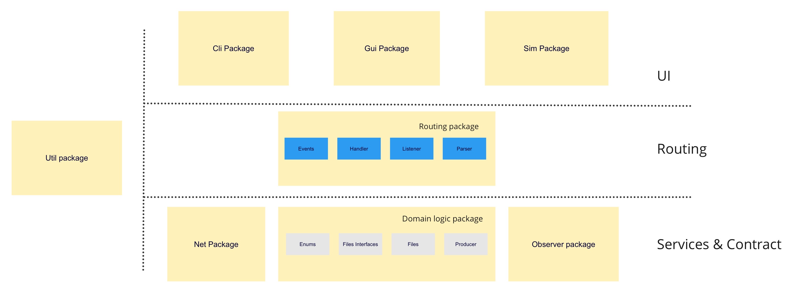

# Beleg PZR1 (92)
Checkboxen befüllen und _kursiv gesetzten Text_ durch entsprechende Angaben ersetzten.
Bei keiner Angabe wird nur Entwurf, Tests, Fehlerfreiheit und Basisfunktionalität bewertet.
Die Zahl in der Klammer sind die jeweiligen Punkte für die Bewertung.
Ergänzende Anmerkungen bitte auch _kursiv setzen_.

## Entwurf (12)
- [4] **Schichtenaufteilung** (4)
- [1] Architekturdiagramm (1)
- [2] Zuständigkeit (2)
- [2] Paketierung (2)
- [2] Benennung (2)
- [0] keine Duplikate (1)

## Tests (28)
- [7] **Testqualität** (7)
- [6] **Testabdeckung GL** (7)
- [6] **Testabdeckung Rest** (6)
  - [1] Einfügen von Produzenten über das CLI _(Cli.java, /routing/parser/ParseCreat.java, 
  /domain_logic/MediaFileRepository.java, /domain_logic/MediaFileRepositoryList.java,  EncapsulationTest.Java)_
  - [1] Anzeigen von Produzenten über das CLI _(Cli.java,/routing/parser/ParseRead.java, domain_logic/MediaFileRepository.java)_
  - [1] ein Beobachter bzw. dessen alternative Implementierung _(CapacityObserver, Tagobserver)_
  - [0] deterministische Funktionalität der Simulationen 
  - [1] Speichern via JOS oder JBP _Cli.java, routing/parse/Persistence, /domain_logic/MediaFileRepositoryList.java_
  - [1] Laden via JOS oder JBP _Cli.java, routing/parse/Persistence, /domain_logic/MediaFileRepositoryList.javan_
- [4] **Mockito richtig verwendet** (4)
- [3] Spy- / Verhaltens-Tests (3)
- [1] keine unbeabsichtigt fehlschlagenden Test (1)

## Fehlerfreiheit (10)
- **Kapselung** (5)
- **keine Ablauffehler** (5)

## Basisfunktionalität (12)
- [2] **CRUD** (2)
- [2] **CLI** (2)
  * Syntax gemäß Anforderungen
- [2] **Simulation** (2)
  * ohne race conditions
- [2 ] **GUI** (2)
- [2] **I/O** (2)
  * in CLI oder GUI integriert
- [2] **Net** (2)

## Funktionalität (22)
- [2] vollständige GL (2)
- [1] threadsichere GL (1)
- [2] vollständiges CLI inkl. alternatives CLI (angeben welche Funktionalität im alternativen CLI deaktiviertvon Tags_
- [2] vollständiges GUI (2)
- [3] mindestens 3 events (2)
- [2] observer ^ property change propagation (2)
- [2] angemessene Aufzählungstypen (2)
- [0] Simulationen 2 & 3 (2)
- [1] data binding (1)
- [0] drag & drop (1)
- [0] JBP und JOS (2)
- [0] TCP und UDP (1)
- [0] mehrere Clients (2)

## zusätzliche Anforderungen (8)
_Es gibt eine Produzentenverwaltung pro Instanz_

- [2] Unterstützung mehrerer Instanzen (2)
- [2] Ansteuerung per CLI (2)
- [2] Ansteuerung per GUI (2)
- [2] richtige Einordnung in der Schichtenarchitektur (2)

## Architekturdiagramm

Gui und Ui greifen über das Routing Package auf Domain Logik (Geschäftslogik) sowie auf das Net und Observer Package zu. Im Util Package befinden sich statischen Methoden für Typenumwandlung, die keine Auswirkungen auf die Kapselung haben und Code Duplikate veringern.

Quellen sind jeweils im Sourcecode mit hinterlegt.
